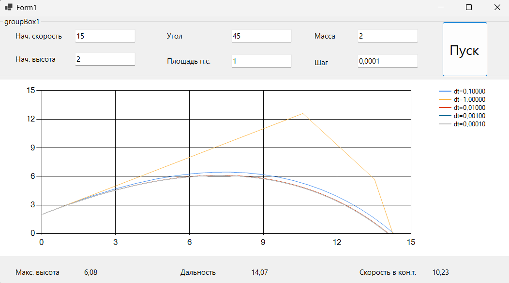

### Моделирование полёта тела в атмосфере

**Задание:**  
Реализовать приложение для моделирования полёта тела в атмосфере.  
Предусмотреть возможность ввода шага моделирования и вывода результатов.

| Шаг моделирования, с | 1 | 0.1 | 0.01 | 0.001 | 0.0001 |
|----------------------|---|-----|------|-------|--------|
| Дальность полёта, м |15.37|14.31|14.11|14.07|14.07|
| Максимальная высота, м |12.61|6.45|6.12|6.09|6.08|
| Скорость в конечной точке, м/с |14.33|10.27|10.25|10.23|10.23|

**Вывод:**
В результате моделирования полёта тела в атмосфере с различным шагом интегрирования dt установлено, что точность расчёта напрямую зависит от выбранного шага: уменьшение dt снижает накопленную погрешность метода. Однако при переходе от dt = 0.01 к dt = 0.001 и менее наблюдаемые изменения траектории становятся незначительными — графики практически сливаются. Это свидетельствует о том, что дальнейшее уменьшение шага не даёт существенного выигрыша в результате, но увеличивает время вычислений. Таким образом, для данной задачи рациональным компромиссом между точностью и производительностью является выбор шага моделирования в диапазоне 0.01–0.001.