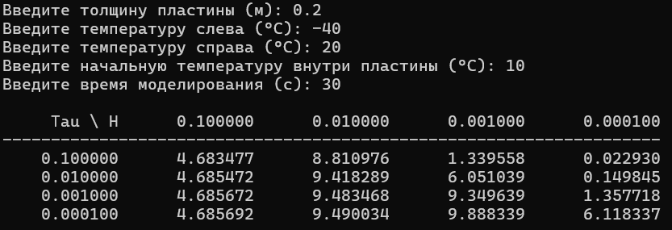

### Метод конечных разностей для уравнения теплопроводности

**Задание:**  
Реализовать моделирование изменения температуры в пластине на основе одномерного уравнения теплопроводности с использованием метода конечных разностей.
Выполнить моделирование с различными шагами по времени и по пространству.  
Заполнить таблицу значений температуры в центральной точке пластины после 2 секунд модельного времени.

**Вывод:**
Метод прогонки показывает устойчивую сходимость при умеренных шагах: при h = 0.01 м температура в центре стабилизируется на уровне ~9.49°C независимо от шага по времени. Крупный шаг h = 0.1 м даёт заниженное значение ~4.69°C* из-за недостаточной детализации сетки. При очень мелких шагах (h ≤ 0.001 м) наблюдается численная неустойчивость: результаты сильно колеблются из-за накопления погрешностей вычислений с плавающей запятой. Таким образом, оптимальным выбором для данной задачи является h = 0.01 м и τ = 0.001 с — это обеспечивает баланс между точностью, устойчивостью и скоростью расчёта.