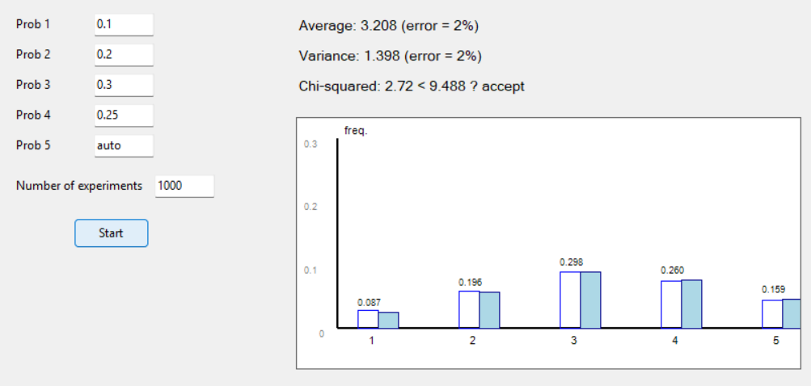
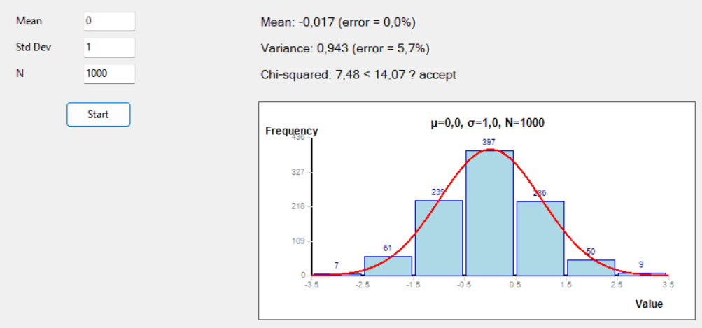

### Имитационное моделирование дискретных случайных величин (GUI)

#### lab06-1
**Задание:**
- Реализовать алгоритм проведения серии экспериментов по генерации дискретной случайной величины, заданной рядом распределения
- Вычислить эмпирические вероятности, выборочные среднее и дисперсию, их относительные погрешности
- Вычислить статистику хи-квадрат и применить критерий хи-квадрат при разных объемах выборки N  (N = 10, 100, 1 000, 10 000)
- Сделать вывод

**Метод обратного преобразования**
**Вероятности: {0.1,0.2,0.3,0.25,0.15}**

| Размер выборки N \ Критерий | $$\chi^2$$ | Относительное отклонение среднего, % | Относительное отклонение дисперсии, % |
|:-------------------------------------------|:-----:|:------:|:-------:|
| **10** | 3.23 | 2 | 31 |
| **100** | 7.32 | 4 | 8 |
| **1000** | 2.98 | 2 | 3 |
| **10000** | 4.65 | 0 | 1 |

#### lab06-2
**Задание:**
- Выполнить моделирование нормальной случайной величины любым методом. Провести статистическую обработку результатов: 

	- построить гистограмму; 
	
	- оценить точность (относительные погрешности, критерий хи-квадрат) для объемов выборки 10, 100, 1000, 10000;

   	- сделать вывод.

**Базовый датчик: на основе преобразования Бокса-Мюллера**
**Математическое ожидание: 2**
**Дисперсия: 4**

| Размер выборки N \ Критерий | $$\chi^2$$ | Относительное отклонение среднего, % | Относительное отклонение дисперсии, % |
|:-------------------------------------------|:-----:|:------:|:-------:|
| **10** | 3.48 | 5.5 | 6.5 |
| **100** | 9.18 | 10.5 | 8.1 |
| **1000** | 8.77 | 4.1 | 4.5 |
| **10000** | 6.58 | 1.7 | 0.3 |

# Вывод

С увеличением объёма выборки погрешности среднего и дисперсии уменьшаются, а критерий хи-квадрат подтверждает соответствие полученной выборки теоретическому распределению.