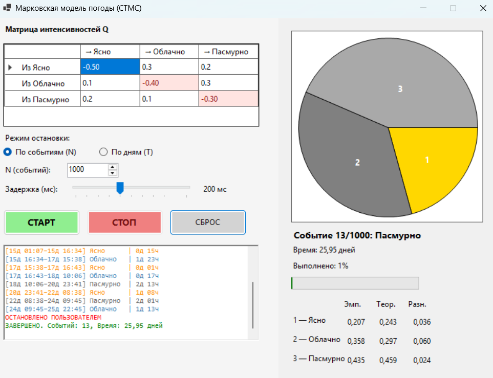

### Марковская модель погоды

**Задание:**  
Смоделировать погоду по дням:

- 1 — ясно  
- 2 — облачно  
- 3 — пасмурно  

Единица времени — **1 день**.  
Задать интенсивности переходов между состояниями.

**Требования:**
1. Выполнить моделирование в «реальном» времени с визуализацией.
2. Провести статистическую обработку результатов.
3. Сравнить эмпирическое распределение с теоретическим стационарным.
4. Сбор статистики и всей необходимой информации в .txt или .csv формат (.csv формат предпочтительней)

### Используемые алгоритмы
Моделирование основано на расчете случайных интервалов времени между сменами погоды. Длительность каждого состояния вычисляется по экспоненциальному закону на основе данных из матрицы интенсивностей $Q$. Когда это время истекает, программа выбирает новое состояние, используя вероятности переходов. Для генерации случайных чисел реализован **мультипликативный конгруэнтный генератор**.

Для оценки точности вычисляются финальные вероятности. Программа преобразует матрицу $Q$ в систему линейных уравнений и решает её методом Крамера, учитывая обязательное условие нормировки.

### Результаты моделирования
Пример результатов для матрицы $Q$ с интенсивностями переходов и общего времени $T = 30$ дней.

| Состояние | Эмпирическая вер-ть | Теоретическая вер-ть | Абс. погрешность |
| :--- | :--- | :--- | :--- |
| **Ясно** | 0.230| 0.243 | 0.014 |
| **Облачно** | 0.166 | 0.297 | 0.131 |
| **Пасмурно** | 0.604 | 0.459 | 0.145 |

### Интерфейс

Приложение реализовано в **Windows Forms**. Содержит:
*   Таблицу для ввода матрицы $Q$ (с авто-расчётом диагонали).
*   Настройки режима (по событиям или по времени) и задержки визуализации.
*   Лог событий и круговую диаграмму для наглядного отображения статистики.

## Вывод
В ходе лабораторной работы была построена модель марковского процесса с непрерывным временем. Основное отличие от дискретной модели заключается в том, что переходы могут происходить в любой момент времени, а длительность пребывания в состоянии является случайной величиной. Сравнение эмпирических данных с теоретическим расчетом (через систему уравнений $\pi Q = 0$) показало сходимость результатов.