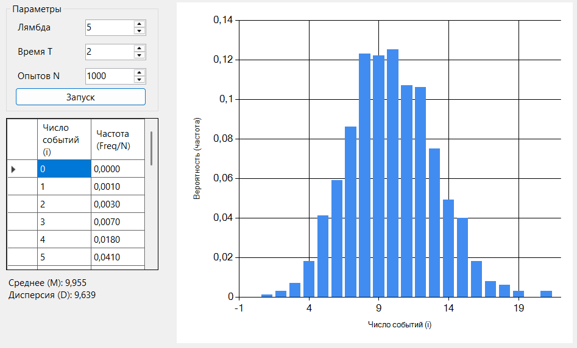

### Пуассоновский поток. События на сервере
Моделирование потока заявок на сервер.

**Задание:**
- событие — поступление заявки;
- определить число заявок за интервал времени T;
- построить распределение числа заявок;
- вычислить среднее и дисперсию;
- сделать вывод.

## Описание проекта
Программа моделирует поток запросов на сервер, используя свойства простейшего потока. В ходе работы реализован самописный генератор псевдослучайных чисел, проведено статистическое моделирование $N$ экспериментов, построена гистограмма эмпирического распределения и вычислены основные статистические показатели.

## Используемые параметры моделирования

| Параметр | Значение | Описание |
|---|---|---|
| **λ (Лямбда)** | 5 | Интенсивность потока (среднее кол-во запросов в ед. времени) |
| **T** | 2 | Интервал наблюдения за сервером |
| **N** | 1000 | Общее количество проведенных экспериментов |
| **Seed** | 10 | Начальное значение (зерно) для генератора MCG |

---

## Реализация модели

### 1. Генератор случайных чисел
Для получения равномерно распределенных величин $u \in (0, 1)$ использован **мультипликативный конгруэнтный генератор (MCG)** со следующими характеристиками:
- Модуль $M = 2^{31} - 1$
- Множитель $\beta = 48271$
- Формула: $x_{i+1} = (x_i \cdot \beta) \pmod M$

### 2. Моделирование потока
События генерируются путем вычисления интервалов между ними. Время между двумя событиями в простейшем потоке распределено по экспоненциальному закону:
$$\tau = -\frac{1}{\lambda} \ln(u)$$
где $u$ — случайное число из интервала $(0, 1)$.

---

## Результаты моделирования

По итогам 1000 прогонов получены следующие статистические данные:

| Характеристика | Эмпирическое значение | Теоретическое значение ($\lambda T$) |
|---|---|---|
| **Среднее M[X]** | 9,955 | 10,0 |
| **Дисперсия D[X]** | 9,639 | 10,0 |

### Визуализация

## Выводы

1. **Подтверждение свойств распределения.** Для пуассоновского потока выполняется ключевое теоретическое свойство: математическое ожидание равно дисперсии ($M = D = \lambda T$). Полученные эмпирические значения (9,955 и 9,639) подтверждают это правило с высокой точностью.
2. **Сходимость результатов.** При выбранном количестве экспериментов ($N = 1000$) наблюдается хорошая сходимость практических данных с теоретической моделью. Гистограмма имеет форму характерного «колокола», центрированного относительно среднего значения.
3. **Эффективность алгоритма.** Использование метода обратных функций совместно с самописным конгруэнтным генератором позволило корректно смоделировать поток событий. Отсутствие легенды и вывод данных от нулевого значения $i$ обеспечивают наглядность и удобство анализа результатов.