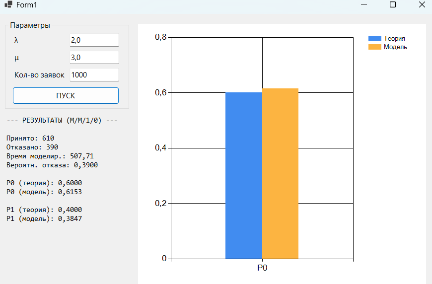

### Система массового обслуживания M/M/1/0
Моделирование одноканальной СМО с потерями (без очереди)

## Используемые параметры
 
| Параметр | Значение | Описание |
|---|---|---|
| λ | 2,0 | Интенсивность поступления заявок |
| μ | 3,0 | Интенсивность обслуживания |
| N | 1000 | Количество моделируемых заявок |
| Seed | Ticks | Зерно генератора (системное время) |
 

 
## Результаты моделирования
 
| Характеристика | Эмпирическое значение | Теоретическое значение |
|---|---|---|
| Коэффициент загрузки ρ | 0,6667 | λ/μ ≈ 0,6667 |
| Вероятность простоя P₀ | 0,6120 | 1/(1+ρ) = 0,6000 |
| Вероятность занятости P₁ | 0,3880 | ρ/(1+ρ) = 0,4000 |
| Абсолютная пропускная способность A | 1,2195 | λ · P₀ = 1,2000 |
| Вероятность отказа P_отк | 0,3880 | P₁ = 0,4000 |
 
---
 
## Выводы
 
1. **Совпадение теории и практики.** Полученные в ходе имитационного моделирования значения вероятностей состояний $P_0$ и $P_1$ незначительно отклоняются от теоретических (погрешность около 1-2%). Это подтверждает адекватность модели. При увеличении числа заявок $N$ точность эмпирических данных возрастает, стремясь к аналитическим значениям.
 
2. **Анализ пропускной способности.** В данной системе без очереди вероятность отказа $P_{отк}$ численно равна вероятности занятости канала $P_1$. Результаты показали, что при интенсивности прихода $\lambda=2$ и обслуживания $\mu=3$ система успешно справляется примерно с 61% потока, в то время как около 39% заявок теряются.

3. **Корректность генерации.** Использование мультипликативного конгруэнтного генератора совместно с методом обратной функции для экспоненциального распределения обеспечило корректную имитацию случайного процесса с заданными параметрами интенсивностей.